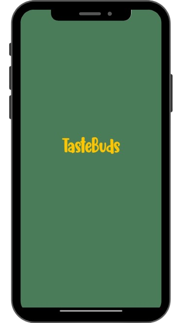
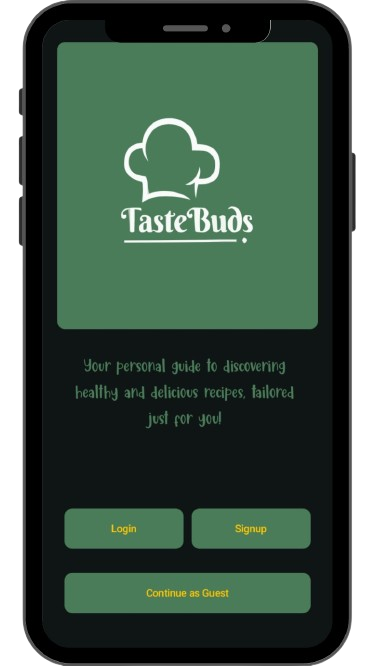
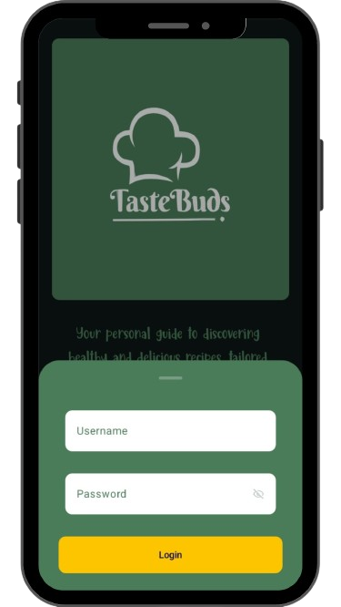
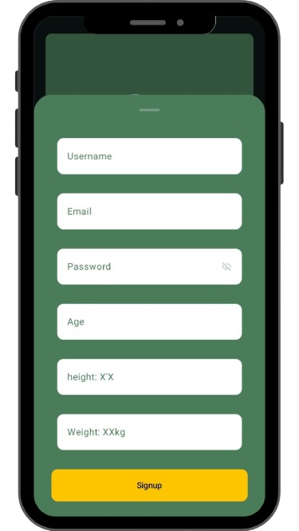
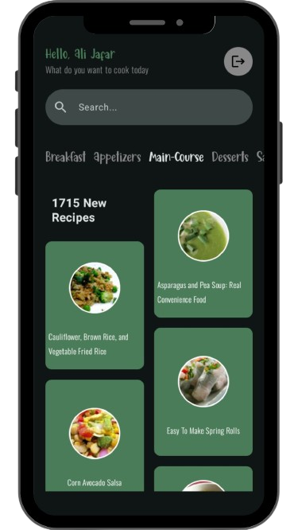
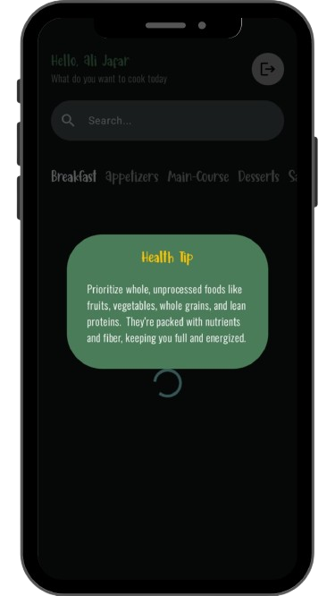
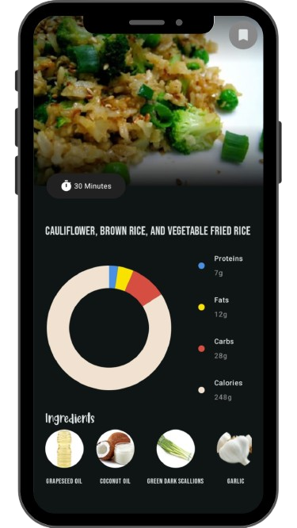

<h1 align="center">
 
  
 
 
TasteBuds
</h1>

## Download

Go to the [releases page](https://github.com/s1lent18/RecipeOrganizer/releases) to download the latest available apk.

## Screenshots

  
  
  
  
  
  

## Development Roadmap

- [x] [Kotlin](https://kotlinlang.org/)
- [x] [LiveData](https://developer.android.com/topic/libraries/architecture/livedata)
- [x] [Navigation](https://developer.android.com/topic/libraries/architecture/navigation)
- [x] [ViewModel](https://developer.android.com/topic/libraries/architecture/viewmodel)
- [x] [Coroutines](https://developer.android.com/topic/libraries/architecture/coroutines)
- [x] [Retrofit](https://square.github.io/retrofit/)
- [x] [Jetpack Compose](https://developer.android.com/jetpack/compose)
- [x] [Firebase](https://firebase.google.com/)
- [x] [Ai Studio](https://aistudio.google.com/)  

## Features

- [x] Recipe Searching
- [x] Calorie Count Tracking
- [x] Notifies @ Cooking Time
- [X] Motivational Prompts 

